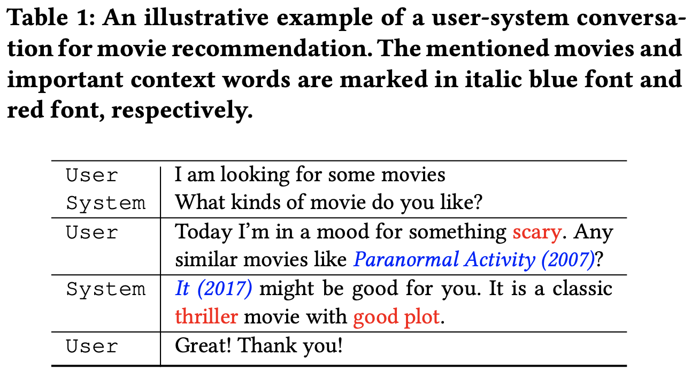
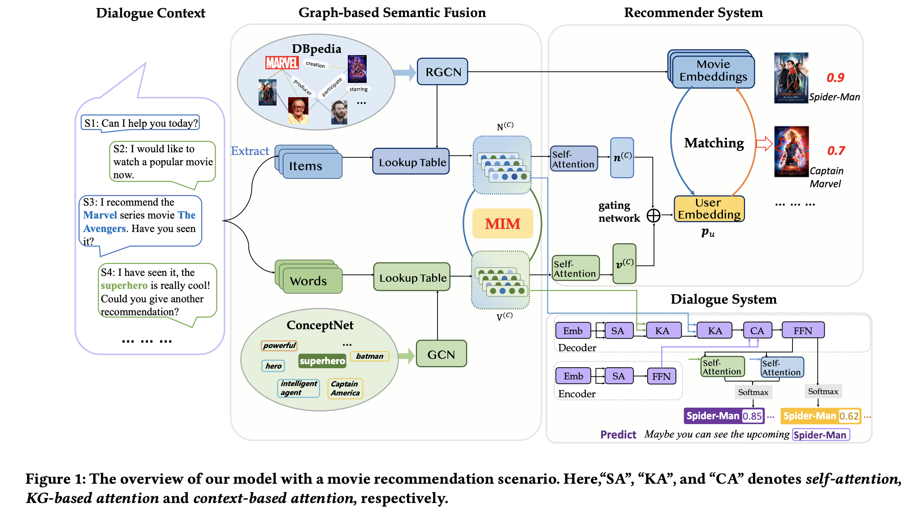

# KGSF
***KDD2020 Improving Conversational Recommender Systems via Knowledge Graph based Semantic Fusion***

Conversational recommender system (CRS) aims to recommend proper items through interactive conversation, hence CRS needs to understand user preference from historical dialog, then produce recommendation and generate responses.



In this paper, we propose KGSF model, which first fuses the semantic between word-oriented and entity-oriented knowledge graph by mutual information maximization (MIM), then leverages the enhanced graph representation for item recommendation and response generation.



# Environment
pytorch==1.3.0, torch_geometric==1.3.2

To be honest, most of errors derive from the wrong installation of the two packages

# Notation
The word embedding file **word2vec_redial.npy** can be produced by the following function dataset.prepare_word2vec(), or directly download from the google netdisk https://drive.google.com/file/d/1BzwGgbUBilaEZXAu7e1SlvxSwcAfVe2w/view?usp=sharing, ***Chinese friends need VPN to download this file***.

# Training
This model is trained by two steps, you should run the following code to pre-train the parameters by Mutual Information Maximization and then learn the recommendation task. Based on my experience, it will converge after 3 epochs pre-training and 3 epochs fine-tuning.

```python run.py```

Then you can run the following code to learn the conversation task. Limitted by the small dataset, Transformer model is difficult to coverge, so our model need many of epochs to covergence. Please be patient to train this model.

```python run.py --is_finetune True```

For convenience, our model will report the result on test data automatically after covergence.

# Thanks for your citation
```c
@inproceedings{DBLP:conf/kdd/ZhouZBZWY20,
  author    = {Kun Zhou and
               Wayne Xin Zhao and
               Shuqing Bian and
               Yuanhang Zhou and
               Ji{-}Rong Wen and
               Jingsong Yu},
  title     = {Improving Conversational Recommender Systems via Knowledge Graph based
               Semantic Fusion},
  booktitle = {{KDD} '20: The 26th {ACM} {SIGKDD} Conference on Knowledge Discovery
               and Data Mining, Virtual Event, CA, USA, August 23-27, 2020},
  pages     = {1006--1014},
  year      = {2020},
  url       = {https://dl.acm.org/doi/10.1145/3394486.3403143}
}
```
